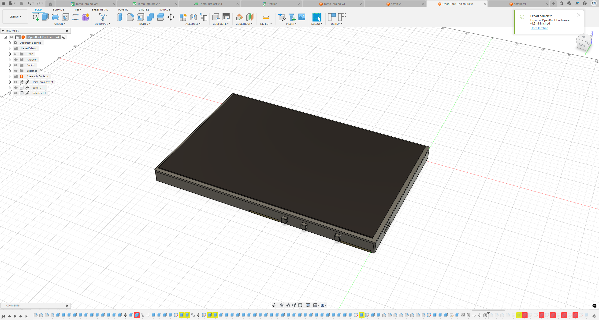

### Nenciu George-Robert 333CC

# TSC_Homework
## Schema pe scurt

 

## Imaginea 3D 

 

# Conexiuni Hardware - Proiect ESP32-C6

## ESP32-C6-WROOM-1-N8 (Microcontroler Principal)
- Interfețe disponibile: SPI, I2C, UART, GPIO

---

## BME688 (Senzor Ambiental)
- Interfață: I2C  
- **Pini utilizați**:  
  - SDA → IO21  
  - SCL → IO22

---

## DS3231SN (Real-Time Clock)
- Interfață: I2C (partajat cu BME688)  
- **Pini utilizați**:  
  - SDA → IO21  
  - SCL → IO22  
  - INT_RTC → IO8  
  - 32KHZ → IO1  
  - RTC_RST → IO18

---

## Afișaj E-Ink (7.5 inch)
- Interfață: SPI  
- Rezoluție: 800 x 480 px  
- **Pini utilizați**:  
  - EPD_CS → IO10  
  - EPD_DC → IO5  
  - EPD_RST → IO23  
  - EPD_BUSY → IO3 *(partajat cu MISO)*  
  - MOSI, SCK *(partajate cu SD)*

---

## Modul SD Card
- Interfață: SPI  
- **Pini utilizați**:  
  - SS_SD → IO4  
  - MOSI → IO7  
  - MISO → IO2  
  - SCK → IO6

---

## Memorie Externă Flash (W25Q512JVEIQ, 64MB)
- Interfață: SPI  
- **Pini utilizați**:  
  - FLASH_CS → IO12  
  - MOSI, MISO, SCK *(partajate cu SD)*

---

## Interfață USB/SD
- Funcții: alimentare + date  
- **Pini utilizați**:  
  - USB_D+ → IO13  
  - USB_D- → IO12

---

## Butoane Boot și Reset
- **Pini utilizați**:  
  - IO/BOOT → IO9  
  - RESET → pin dedicat *(conform schemei)*

---

## Sistem de Alimentare și Management
- Baterie Li-Po: 3.7V, 2500mAh  
- **Module și pini**:
  - MCP73831 → încărcare prin USB-C  
  - MAX17048 → monitorizare baterie  
    - SDA → IO21  
    - SCL → IO22  
  - XC6220A331MR-G → 3.3V stabilizat

---

## Conector USB-C
- Funcții: alimentare principală și transfer de date  
- Protejat ESD

---

## Conector Qwiic / Stemma QT
- Interfață: I2C  
- **Pini utilizați**:
  - SDA → IO21  
  - SCL → IO22

ESP32-C6 are un consum de energie optimizat pentru aplicații IoT. În modul activ, consumul variază în funcție de sarcină, dar poate fi redus semnificativ în modurile de repaus profund. De exemplu, în modul Deep Sleep, consumul poate fi de ordinul microamperilor, ceea ce permite o durată de viață extinsă a bateriei.

## Alte considerații

În proiectare, s-a ținut cont de recomandările din ghidul de design hardware pentru ESP32-C6 , asigurându-se că traseele PCB pentru interfața I2C sunt cât mai scurte și ecranate corespunzător pentru a minimiza interferențele. De asemenea, s-a acordat atenție alimentării corecte a senzorului BME680, conform specificațiilor acestuia.​

Pentru o integrare eficientă a componentelor și optimizarea performanței, s-au urmat recomandările din documentația oficială a ESP32-C6 și a componentelor asociate.

| Componentă | Nr. bucăți | Nume material | Link către datasheet |
|---|---|---|---|
| EAGLE-LTSPICE_C0402 | 26 | Discrete Component | https://eu.mouser.com/datasheet/2/447/KEM_C1023_X7R_AUTO_SMD-3316698.pdf |
| ESP32_WROVER_AVX---SD0805S020S1R0_AVX_SD0805S020S1R0_0 | 2 | Discrete Component | https://eu.mouser.com/datasheet/2/40/AutoMLCCKAM-3216307.pdf |
| ESP32_WROVER_EAGLE-LTSPICE_R0402 | 22 | Discrete Component | https://eu.mouser.com/datasheet/2/54/cr-1858361.pdf |
| TP20R | 17 | Discrete Component | https://www.koaspeer.com/pdfs/RN73R.pdf |
| ESP32_WROVER_SPARKFUN-IC-POWER_SOT23-5 | 1 | Discrete Component | https://eu.mouser.com/datasheet/2/891/Espressif_Systems_ESP32_WROVER_E_L_0-3049094.pdf |
| ADAFRUIT_CHIP-LED0603 | 1 | Discrete Component | https://www.vishay.com/doc?82437 |
| ESP32_WROVER_BME680_PSON80P300X300X100-8N | 1 | Discrete Component | https://eu.mouser.com/datasheet/2/783/BST_BME680_DS001-1509608.pdf |
| ESP32C6_VARISTOR_CT/CN1812 | 1 | Discrete Component | https://product.tdk.com/system/files/dam/doc/product/protection/voltage/varistor_ctvs/data_sheet/75/db/ctvs_14/ct1210s14bautogx1.pdf |
| DIOC1608X36N | 6 | Discrete Component | https://eu.mouser.com/datasheet/2/802/1703143356438-3483895.pdf |
| SOT95P280X120-5N | 1 | Discrete Component | https://www.onsemi.com/PowerSolutions/product.do?id=MC74VHC1GT32P5T5G |
| CAPCP3225X100N | 1 | Discrete Component | https://eu.mouser.com/datasheet/2/18/2/CAP_CACFSBA1-3557832.pdf |
| RCL_CT3528 | 1 | Discrete Component | https://www.vishay.com/doc?20046 |
| ESP32_WROVER_SPARKFUN-DISCRETESEMI_SOT23-3 | 2 | Discrete Component | https://eu.mouser.com/datasheet/2/891/Espressif_Systems_ESP32_WROVER_E_L_0-3049094.pdf |
| SAMACSYS_PARTS_USB4110GFA | 1 | Discrete Component | https://eu.mouser.com/datasheet/2/837/GCT_USB4120-3159195.pdf |
| JST04_1MM_RA | 1 | Discrete Component | https://eu.mouser.com/datasheet/2/564/eCPT-3475515.pdf |
| SOIC127P1032X265-16N | 1 | Discrete Component | https://www.ti.com/lit/ug/sbou289/sbou289.pdf?ts=1664458800011&ref_url=https%253A%252F%252Fwww.ti.com%252Ftool%252FSURFACE-MOUNT-ADAPTER-EVM%253FkeyMatch%253D%2526tisearch%253Dsearch-everything%2526usecase%253Dhardware |
| XCVR_ESP32-C6-WROOM-1-N8 | 1 | Discrete Component | https://eu.mouser.com/datasheet/2/891/esp32_c6_datasheet_en-3304070.pdf |
| SOT95P280X145-6N | 1 | Discrete Component | https://eu.mouser.com/datasheet/2/414/DIV23-3532318.pdf |
| SOT95P280X125-5N | 1 | Discrete Component | https://eu.mouser.com/datasheet/2/414/DIV23-1551440.pdf |
| FH34SRJ24S05SH99 | 1 | Discrete Component | https://eu.mouser.com/datasheet/2/833/cherry_Rocker_SR_Round_EN-1275415.pdf |
| SON127P600X800X80-9N | 1 | Discrete Component | https://www.ti.com/lit/gpn/tps63710 |
| 16-soldermask | 1 | Steel | https://eu.mouser.com/datasheet/2/58/BPS-DAT-(BB3U)-Datasheet-1282462.pdf |
